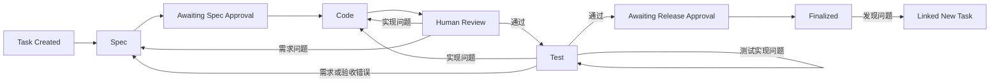

# SDLC Pipeline

面向 OpenCode 的轻量交付状态机。AI 负责需求、实现和测试判断；Python Core 只负责 Task 状态、
正式 Spec、代码/测试门禁和最终固化。

## 安装

```powershell
python scripts/install_project.py --target <project>
```

安装后重启 OpenCode，执行 `/sdlc-init`。

## 最终流程



用户命令：

- `/sdlc-init`
- `/sdlc-spec`
- `/sdlc-code`
- `/sdlc-test`

插件工具：

- `sdlc_status`
- `sdlc_task`
- `sdlc_spec`
- `sdlc_lifecycle`
- `sdlc_finalize`

## 存储

```text
.sdlc-pipeline/
  state/task.json
  work/input.md
  evidence/task-events.jsonl
  evidence/records/

docs/sdlc/
  current.json
  baselines/<content-hash>/
    manifest.json
    spec.md
    requirements/
    designs/
    verification/
```

- `input.md` 只追加用户原始需求、补充和缺陷反馈。
- prepare 只在 `task.json` 保存待确认的 Spec hash，不保存临时正文。
- approve 后直接发布正式 baseline。
- JSON 只保存状态、ID、路径和 hash；需求正文在 Markdown。
- 外部文件由 OpenCode 按用户授权直接读取，插件不摄取、不复制、不建立 Source。
- 插件不负责会话恢复；会话上下文属于 OpenCode。
- Git 保存正式代码和文档历史。

## 验证

```powershell
$env:PYTHONDONTWRITEBYTECODE = "1"
python -X utf8 -m unittest discover -s tests -v
node --check .opencode/plugins/sdlc-pipeline.js
git diff --check
```
