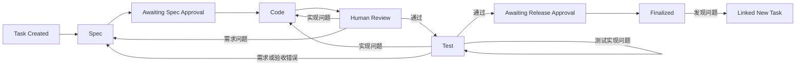

# SDLC Pipeline

面向 OpenCode 的轻量交付状态机。AI 负责需求、实现和测试判断；Python Core 只负责 Task 状态、
正式 Spec、代码/测试门禁和最终固化。

## 安装与升级

在目标项目根目录执行远程安装：

```powershell
curl.exe -fsSL https://raw.githubusercontent.com/Gandufu/sdlc-pipeline/main/scripts/install_project.py | python - --target .
```

升级已安装的插件：

```powershell
curl.exe -fsSL https://raw.githubusercontent.com/Gandufu/sdlc-pipeline/main/scripts/install_project.py | python - --target . --force
```

在本仓库开发或审计时，可直接使用固定的本地源码安装到隔离项目：

```powershell
python scripts/install_project.py --target <project>
```

`--force` 会覆盖插件管理的文件并清理安装器声明的旧布局，不要对需要保留旧运行现场的项目直接执行。
安装后重启 OpenCode，执行 `/sdlc-init`。

## 最终流程



用户命令：

- `/sdlc-init`
- `/sdlc-spec`
- `/sdlc-code`
- `/sdlc-test`

插件工具：

- `sdlc_status`
- `sdlc_task`
- `sdlc_spec`
- `sdlc_lifecycle`
- `sdlc_finalize`

## Agent 角色与模型

`sdlc-main` 是拥有完整项目读写和命令能力的主会话，负责架构判断、状态流转、回退和派发。
`sdlc-coder` 与 `sdlc-tester` 使用独立 context，分别交付实现和独立测试；它们不是受限目录执行器。
角色通过模型、task prompt、紧凑阶段 brief 和 handoff 区分，Core 不在工具调用前实施目录 ACL。

OpenCode 支持为每个 agent 单独选择模型。例如可在项目 `opencode.json` 中配置：

```json
{
  "$schema": "https://opencode.ai/config.json",
  "default_agent": "sdlc-main",
  "agent": {
    "sdlc-main": {"model": "<architecture-model>"},
    "sdlc-coder": {"model": "<coding-model>"},
    "sdlc-tester": {"model": "<test-model>"}
  }
}
```

未单独指定时，子代理继承主会话模型。

Electron 模板固定使用项目根目录 `assets/` 存放原型直接引用的 PNG、字体等静态资源。
该路径通过 coder context 的 `brief.asset_paths` 提供，不由 Core 摄取、解析或复制。

## 存储

```text
.sdlc-pipeline/
  state/task.json
  work/input.md
  work/pending-spec.md       # 仅等待 Spec 审批时存在
  work/records/*-handoff.md
  evidence/task-events.jsonl
  evidence/records/

docs/sdlc/
  current.json
  baselines/<content-hash>/
    manifest.json
    spec.md
    requirements/
    designs/
    verification/
```

- `input.md` 只追加用户原始需求和需求补充；监督结果、实现缺陷和测试缺陷通过
  `<sdlc-feedback>` 透传，不污染原始需求。
- prepare 将待审批正文暂存为 `work/pending-spec.md`，`task.json` 只保存 hash。
- approve 只提交 `content_hash + confirmed=true`；Core 校验 pending、发布正式 baseline，
  随后删除 pending。
- JSON 只保存状态、ID、路径和 hash；需求正文在 Markdown。
- 外部文件由 OpenCode 按用户授权直接读取，插件不摄取、不复制、不建立 Source。
- 插件不负责会话恢复；会话上下文属于 OpenCode。
- Git 保存正式代码和文档历史。

## 验证

```powershell
$env:PYTHONDONTWRITEBYTECODE = "1"
python -X utf8 -m unittest discover -s tests -v
node --check .opencode/plugins/sdlc-pipeline.js
git diff --check
```
