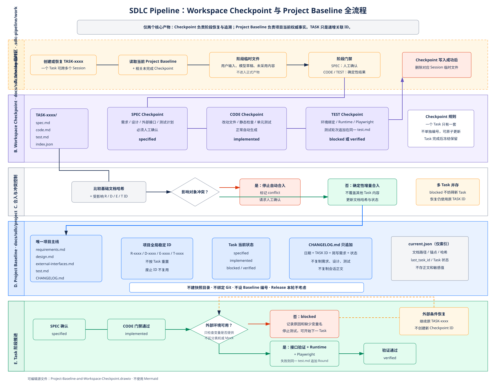

# Project Baseline 与 Workspace Checkpoint 综合方案

状态：方案确认

适用范围：SDLC Pipeline 当前阶段

暂不包含：Release、完整 CSCI 配置管理、多级正式评审

## 1. 背景与目标

当前流水线以单次 Spec Candidate 为中心：每轮需求从空集合开始，审核后将本轮 Candidate 发布成一个自包含 Baseline，再删除临时工作内容。这能保留单次会话产物，却不能持续形成完整的项目需求、设计、外部接口和测试文档。

本方案将流水线调整为“项目主线 + 任务工作检查点”：

- 项目级文档持续积累，不因新会话重新开始。
- 一个 `TASK-xxxx` 覆盖需求、编码、测试完整流程，可以跨多个 Session。
- Session 中未审核内容是临时文件。
- 阶段确认后生成 Workspace Checkpoint，支持中断恢复和历史追溯。
- Project Baseline 是持续增量更新的项目权威主线，不是快照目录。
- JSON 永远只做索引，不保存会话或业务正文。
- 当前设计保持轻量，不提前实现完整 CSCI 软件配置管理流程。

## 2. 当前实现问题

现有实现存在以下结构性问题：

1. Candidate 的 R/D/T 集合每次从空状态开始，后续需求不能自然继承既有项目事实。
2. 当前 Baseline 实际是一次 Candidate 的完整复制，语义仍然绑定本轮会话。
3. `current.json` 只能选择一个会话级 Spec Baseline，无法表达持续演进的项目主线。
4. Candidate 清理后只剩紧凑 receipt，项目缺少可直接阅读的总需求、总设计、外部接口和总测试文档。
5. 新增功能可能重复询问已经明确的设备或子系统接口。
6. Version、会话状态、Candidate 和 Baseline 之间职责交叉，容易把发布、版本控制和项目基线混成一个概念。

因此，需要替换“会话 Candidate 直接成为 Baseline”的模型，而不是继续在现有 Baseline 目录上叠加更多类型。

## 3. 设计原则

本方案遵循以下约束：

- 只保留两个核心落盘概念：Workspace Checkpoint 与 Project Baseline。
- `TASK-xxxx` 只是递增关联 ID，不是第三类正式产物。
- Session 只是执行载体，不是事实来源。
- Markdown 保存需求、设计、测试和阶段结论。
- JSON 只保存 ID、状态、路径、锚点、引用和哈希。
- Project Baseline 不复制快照、不绑定 Git commit、不设置独立编号。
- Git 可以由项目自行使用，Core 不规定提交时机。
- Release 暂不纳入本轮设计。
- 人工门禁集中在业务决策；确定性检查自动执行。
- 出现冲突、阻塞或约束跑偏时停止并请求人工介入，不无限尝试。

## 4. 领域模型

### 4.1 Workspace Checkpoint

Workspace Checkpoint 是一个 Task 在 SPEC、CODE、TEST 阶段的当前受控状态。

每个 Task 固定包含：

```text
TASK-000023/
├─ spec.md
├─ code.md
├─ test.md
└─ index.json
```

一个 Task 不为 Checkpoint 单独编号。阶段返工更新同一个文件，测试轮次追加在同一个 `test.md` 中。Task 结束后文件被冻结并长期保留。

### 4.2 Project Baseline

Project Baseline 是项目唯一、持续增量更新的权威主线：

```text
docs/sdlc/project/
├─ requirements.md
├─ design.md
├─ external-interfaces.md
├─ test.md
└─ CHANGELOG.md
```

它不建立历史快照目录，也不依赖 Git commit 作为身份。历史变化通过 Change Log 和各 Task 的 Workspace Checkpoint 追溯。

### 4.3 Task 与 Session

- `TASK-xxxx` 在项目内递增，一个 Task 表示一次需求到测试的完整工作。
- 一个 Task 可以跨多个 OpenCode Session。
- Workspace 绑定 Task，不绑定 Session。
- Session ID 只允许作为本地恢复定位信息，不能保存对话正文，也不能进入 Project Baseline。

## 5. 总体流程图



可编辑的 Draw.io 源文件：

- [Project-Baseline-and-Workspace-Checkpoint.drawio](Project-Baseline-and-Workspace-Checkpoint.drawio)

图中橙色表示未审核临时文件，紫色表示长期保留的 Workspace Checkpoint，蓝色表示 Project Baseline，绿色表示 CODE/TEST 自动门禁，红色表示阻塞或冲突。

## 6. 存储布局

```text
.sdlc-pipeline/
├─ runtime/
├─ contracts/
├─ state/
│  ├─ current-task.json
│  └─ sessions/
└─ work/
   └─ TASK-000023/
      ├─ spec/
      ├─ code/
      └─ test/

docs/sdlc/
├─ checkpoints/
│  ├─ TASK-000022/
│  │  ├─ spec.md
│  │  ├─ code.md
│  │  ├─ test.md
│  │  └─ index.json
│  └─ TASK-000023/
│
├─ project/
│  ├─ requirements.md
│  ├─ design.md
│  ├─ external-interfaces.md
│  ├─ test.md
│  └─ CHANGELOG.md
│
└─ current.json
```

`.sdlc-pipeline/work/` 中只存在未审核的 Session 临时内容。阶段 Checkpoint 成功生成后，对应临时文件删除。`docs/sdlc/checkpoints/` 中的正式 Checkpoint 长期保留。

不再创建：

- `docs/sdlc/tasks/`
- `docs/sdlc/changes/`
- `docs/sdlc/revisions/`
- `docs/sdlc/baselines/<snapshot>/`
- 独立 Task History 正文

## 7. JSON 与 Markdown 职责

JSON 允许保存：

- Task ID；
- 当前阶段及状态；
- Markdown 相对路径；
- Markdown 标题锚点；
- 内容哈希；
- 当前 Project Baseline 文档哈希；
- Checkpoint 创建时所依据的文档哈希；
- Task 之间的影响引用；
- Session 到 Task 的本地恢复定位。

JSON 禁止保存：

- 用户完整输入；
- 模型完整回复；
- 需求、设计、接口或测试正文；
- 测试日志全文；
- 设备 IP、密码、令牌；
- 为了方便而复制的 Markdown 内容。

示例索引：

```json
{
  "task_id": "TASK-000023",
  "state": "implemented",
  "checkpoints": {
    "spec": {
      "ref": "docs/sdlc/checkpoints/TASK-000023/spec.md",
      "sha256": "sha256:..."
    },
    "code": {
      "ref": "docs/sdlc/checkpoints/TASK-000023/code.md",
      "sha256": "sha256:..."
    },
    "test": null
  },
  "project_base_hashes": {
    "requirements": "sha256:...",
    "design": "sha256:..."
  }
}
```

该 JSON 只是导航和校验索引，真实内容仍然位于 Markdown。

## 8. SPEC Checkpoint

SPEC 阶段读取：

- 当前 Project Baseline；
- 与本 Task 相关的 R/D/E/T 条目；
- 未完成 Task 中与当前范围相关的 Checkpoint；
- 用户本轮输入和原型来源。

只询问以下内容：

- 项目中从未定义的事实；
- 本轮明确要求修改的事实；
- 与现有 Project Baseline 冲突的事实；
- 外部依赖能力不明确的事实；
- 会改变范围、安全边界或验收方式的决策。

SPEC Checkpoint 包含：

- 本轮简写需求；
- 受影响的项目级 R/D/E/T ID；
- 新增或修改的需求、设计和接口增量；
- 测试计划；
- 禁止操作和外部依赖；
- 用户明确确认；
- 创建时的 Project Baseline 文档哈希。

SPEC 是唯一必须人工确认的正常阶段。确认后：

1. 写入或更新 `spec.md`。
2. 更新 `index.json`。
3. 检查与当前 Project Baseline 的冲突。
4. 无冲突时增量更新项目主线。
5. 在 Change Log 追加 Task 简写记录和 `specified` 状态。
6. 删除 SPEC 临时会话文件。

## 9. CODE Checkpoint

CODE 阶段使用 SPEC Checkpoint 和当前 Project Baseline，不依赖原始聊天上下文。

CODE Checkpoint 至少记录：

- 实际修改文件；
- R/D/E/T 与代码文件的追溯；
- 编译、lint、typecheck、单元测试结果；
- 代码约束审计结果；
- 未解决问题；
- 触发返工的测试轮次引用；
- 创建时的 Project Baseline 文档哈希。

正常情况下，确定性门禁通过后自动生成 CODE Checkpoint，不要求用户重复确认。以下情况必须打断：

- 实现范围超过 SPEC；
- 违反只读、禁止写入等规则；
- 项目约束与实现冲突；
- 静态检查无法通过；
- Checkpoint 与当前项目文档发生合并冲突。

CODE Checkpoint 合入后，Project Baseline 将相关 Task 状态更新为 `implemented`。

## 10. TEST Checkpoint

测试只验证当前 Task 声明的功能和受影响回归范围，不区分接口后端是真机还是 Mock。

执行顺序：

1. 产品测试前置检查。
2. 外部环境变量完整性检查。
3. 不依赖 Runtime 的外部接口验证。
4. Runtime 启动、所有权和健康检查。
5. Playwright 功能测试。
6. 清理 Runtime。
7. 写入 TEST Checkpoint。

外部接口正式文档只声明：

- 接口能力；
- 操作约束；
- 协议或调用约定；
- 所需环境变量名称；
- 是否为敏感变量。

设备 IP、密码和 Token 只在运行时注入，不进入 Project Baseline 或 Checkpoint。

如果设备未到货、接口地址未提供或外部环境不可用：

- 不运行无意义的 Playwright；
- 不使用插件内部 Mock 替代；
- `test.md` 记录阻塞原因和所缺环境变量名称；
- Task 状态更新为 `blocked`；
- Project Baseline 可以继续更新当前真实工程状态；
- 允许开始下一个 Task；
- 外部条件满足后恢复同一个 Task。

测试返工不创建新的 Checkpoint ID，而是在同一个 `test.md` 中追加轮次：

```markdown
## Round 1

- 结果：失败
- 缺陷：连接错误提示不符合 R-0003
- 处理：返回 CODE 阶段

## Round 2

- 结果：通过
- 修复依据：Round 1
- 证据：受控测试结果引用
```

最终验证通过后，Task 状态更新为 `verified`。

## 11. Project Baseline 增量维护

Project Baseline 不是“全部功能均验证通过”的发布状态，而是项目当前受控的真实工程状态。

允许的 Task 状态：

| 状态 | 含义 |
|---|---|
| `specified` | SPEC 已确认并合入项目主线 |
| `implemented` | CODE 已通过确定性门禁 |
| `blocked` | 当前阶段因外部条件或明确问题无法继续 |
| `verified` | TEST 已完成并通过 |

任一阶段形成有效 Checkpoint 后，都可以增量更新 Project Baseline。这样设备暂未到货时，项目仍然可以准确记录“编码完成、测试阻塞”，并允许后续 Task 继续推进。

`CHANGELOG.md` 保持最小、只追加：

```markdown
## 2026-07-29

- TASK-000023：设备连接与系统信息只读查看；状态：implemented，真机测试阻塞。
```

Change Log 不复制完整需求、设计、测试结果或会话内容。

## 12. 多 Task 并存与冲突检测

系统允许多个未完成 Task 并存：

```text
TASK-000023  blocked
TASK-000024  implemented
TASK-000025  specified
```

每个 Checkpoint 必须记录其创建时所依据的 Project Baseline 文档哈希和受影响 R/D/E/T ID。

合入前，Core 执行：

1. 比较 Checkpoint 基础哈希与当前项目文档哈希。
2. 如果文档未变化，直接合入。
3. 如果文档变化但影响 ID 不重叠，执行确定性增量合并。
4. 如果影响同一 R/D/E/T 或外部接口，状态进入 `conflict`。
5. 冲突时停止自动合入并要求人工确认。
6. 不覆盖其他 Task 已合入内容，不无限重试。

新 Task 创建时必须读取所有与本轮范围相关的未完成 Checkpoint，避免把 `blocked` 功能误认为已经验证。

## 13. Core Module 与 Interface

实现应集中为少量深 Module，OpenCode Hook 只调用 Interface：

### Workspace Module

Interface：

- 开始或恢复 Task；
- 写入阶段临时内容；
- 发布 SPEC/CODE/TEST Checkpoint；
- 清理已发布阶段的 Session 临时文件。

实现内部负责原子写入、哈希、状态转换和恢复。

### Project Baseline Module

Interface：

- 读取与 Task 相关的项目上下文；
- 预检 Checkpoint 合入；
- 合并 Checkpoint；
- 返回冲突或新的项目文档哈希。

实现内部负责 Markdown 锚点、全局 ID、引用完整性、Change Log 和冲突检测。

### Lifecycle Module

Interface：

- 执行 CODE 门禁；
- 检查外部环境要求；
- 启动和验证 Runtime；
- 执行功能测试；
- 返回确定性结果。

技术栈差异由 Adapter 实现。Electron 和未来 Spring Boot 只需提供同一 Interface，不把技术栈判断放进 Core。

### OpenCode Adapter

保持薄层：

- 将工具调用转换为 Core Interface；
- 绑定当前 Task；
- 报告缺失输入、冲突和阻塞；
- 不在 Hook 中维护状态机或业务规则。

## 14. 实施计划与验收

### 第一阶段：存储与术语

- 将现有 Candidate 流程替换为 Task Workspace。
- 引入 `docs/sdlc/checkpoints/TASK-xxxx/`。
- 引入五份 Project Baseline 主线文档。
- 删除会话 Baseline 快照语义。
- 更新 Glossary、README 和当前设计文档。

### 第二阶段：Checkpoint

- 实现 SPEC/CODE/TEST 三个固定 Checkpoint。
- 实现 Task 跨 Session 恢复。
- 实现阶段临时文件发布后清理。
- 实现 SPEC 人工确认、CODE/TEST 自动门禁。

### 第三阶段：Project Baseline

- 实现项目全局 R/D/E/T ID 分配。
- 实现 Markdown 增量合并。
- 实现 Task 状态投影和最小 Change Log。
- 实现 Project Baseline 文档哈希索引。

### 第四阶段：并行与外部环境

- 实现多 Task 基础哈希和影响对象检测。
- 实现冲突停止与人工介入。
- 实现外部环境变量声明和 `blocked` TEST Checkpoint。
- 保持 Mock/真机实现对 Core 透明。

### 验收场景

1. 第一个 Task 形成 SPEC、CODE、TEST Checkpoint，并增量建立五份项目主线文档。
2. 第二个 Task 自动读取既有设备接口，不重复询问已经明确的接口能力。
3. 一个 Task 跨三个 Session 后仍从同一 Workspace Checkpoint 恢复。
4. 阶段 Checkpoint 形成后，对应临时会话文件被删除。
5. JSON 中不存在需求、设计、测试和会话正文。
6. CODE 完成、设备未到货时生成 `blocked` TEST Checkpoint。
7. 阻塞 Task 不妨碍新 Task 创建和推进。
8. 外部环境恢复后继续原 Task，而不是创建新 Task 或新 Checkpoint 编号。
9. 两个 Task 修改不同 R/D/E/T 时可以自动合入。
10. 两个 Task 修改同一外部接口时进入 `conflict`，不自动覆盖。
11. Change Log 只包含日期、Task ID、简写需求和阶段状态。
12. Project Baseline 不产生快照目录、不绑定 Git、不执行 Release。

本方案完成的是当前阶段可维护的最小软件工厂基础：Workspace Checkpoint 负责过程恢复和阶段证据，Project Baseline 负责项目长期事实，两者通过递增 Task ID 关联，但不再引入额外的 Task History、Change Package、Revision 或发布模型。
